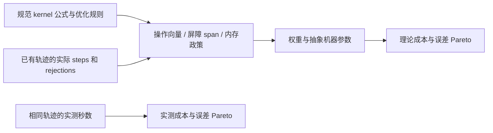

# Burgers 规范计算模型 v1

这个模型把每个 solver 的**数值 kernel 计算图**和实际 rollout 计数结合，
用于比较统一抽象机器下的计算成本。它不计 Python/NumPy/Fortran 指令，
也不预测真实 CPU/GPU 秒数。原始 wall time 继续单独报告。

## 它更像 CPU 还是 GPU？

**当前版本既不是 CPU 模拟器，也不是 GPU 模拟器。准确名称是：规范数值计算图 +
抽象并行资源模型。** 操作向量本身不指定硬件；把它转换成一个成本标量时，
才引入权重、并行吞吐和内存政策。统一模型消除了直接按实现语言计时的影响，
但结果仍依赖所选择的表达式、调度、优化和原语，因此也不是算法唯一的固有成本。

执行方式是同一 kernel 内不同单元并行、kernel/stage 之间有屏障，
结构上适合描述数据并行计算；CPU SIMD/多线程与 GPU SIMT 都能实现这种结构。
仅凭“按单元并行”或“两侧分支都算”不能将其认定为 GPU。

| 模型部分 | 当前含义 | 不能直接解释成什么 |
|---|---|---|
| `operations` | 规范图每种标量原语的次数 | 编译后指令数、CPU cycles、GPU 指令数 |
| `lanes=8` | 每 tick 理想处理 8 单位加权工作的总容量 | 8 个 CPU 核心、8 个 CUDA 线程或 SIMD 宽度 |
| `barrier_span` | 无限单元并行度下，声明屏障调度的算术依赖深度 | 某块 CPU/GPU 的实际延迟 |
| `bytes_per_tick=64` | 抽象机器每 tick 传输 64 字节 | 64 GB/s；tick 未对应真实秒 |
| `fast_memory_bytes=32768` | 对整个规范工作区使用的单一容量门槛 | CPU L1 的完整行为、GPU 每个 block 的 shared memory |
| `division8` | 将除法工作与延迟权重都设为 8 的假想 profile | 特定硬件的 FP64 除法吞吐或延迟 |

如果一定要作直觉类比，**默认的小并行容量可以想成一个小型向量处理单元**，
但这只是类比；不能据此说默认值经过 CPU 标定，更不能声称代表整块 GPU。
想模拟 GPU，简单增大 lanes 不够；想模拟 CPU，设置 lanes=1 也不够。

### 尚未建模的硬件行为

| 目标 | 为更可信的硬件预测，还需要显式处理的因素 |
|---|---|
| CPU | 指令吞吐与依赖延迟的区别、执行端口、SIMD 利用率、线程调度、缓存层级、内存延迟与带宽、分支处理 |
| GPU | warp/block/SM 调度、occupancy、寄存器与 shared-memory 限制、合并访存、分支执行、kernel 启动与同步、主机–设备传输、设备相关 FP64 吞吐 |
| 两者共同 | 编译器融合与 FMA、实际数组布局、循环与分配开销、有限网格的并行利用率、数据复用与分块 |

上表是后续模型扩展需要关注的因素，不是已实现的功能。
CPU 的吞吐/延迟和优化约束参见 [Intel 官方优化手册入口](https://www.intel.com/content/www/us/en/developer/articles/technical/intel64-and-ia32-architectures-optimization.html)；
GPU 的 SIMT、访存与 occupancy 参见 [NVIDIA CUDA 编程指南](https://docs.nvidia.com/cuda/cuda-programming-guide/02-basics/writing-cuda-kernels.html)，
计时、数据传输与优化边界参见 [CUDA Best Practices Guide](https://docs.nvidia.com/cuda/pdf/CUDA_C_Best_Practices_Guide.pdf)。
这些文档描述硬件机制，不为本项目默认参数提供校准依据。

## 模型的三层结构



1. **算法执行记录层**：明确 flux、reconstruction、RK、网格、CFL 产生的步数和重试。
   相同 N、相同 horizon 不保证相同步数；因此不能仅比较一次 RHS 的 FLOPs。
2. **规范计算层**：统一表达式及优化政策，输出工作向量、深度和声明的流量。
   数值误差仍来自原 solver 的真实输出；不会用计算模型推导或替代误差。
3. **资源评分层**：用明确的权重、容量和带宽把向量压缩成标量。
   改这一层可能改排名，必须保留原始向量和 profile 以便复核。

例如接受 100 步、拒绝 2 次的 modular SSPRK3：有 304 次 RHS，
306 次 stage update，而不是简单地把所有工作乘上 300 或 306。
这个例子解释计数规则，不是新增实验结果。

## 使用接口

```python
from hyperbench.cost_model import analyze, virtual_score

cost = analyze(
    "fv_llf_weno5z_rk3", n=160,
    metadata=[{"steps": 200, "rejected_steps": 1}],
    snapshots=10, profile="division8", fast_memory_bytes=32768,
)
print(cost["operations"])       # 各类操作计数
print(cost["weighted_work"])    # 该权重下的总数值 kernel 工作量
print(cost["barrier_span"])     # 声明的 kernel/stage 屏障调度的依赖深度
print(virtual_score(cost))      # 虚拟 ticks，绝不是秒
```

这里的 metadata 只是接口示例；科学报告必须传入 solver 实际记录的计数，
不能以示例数字替代测量。metadata 接受一次或多次重复运行的字典列表；
所有重复必须具有相同 steps/rejected_steps，否则拒绝分析。
成本表示**一次轨迹**，不会乘上 warmup 或计时重复次数。

`analyze` 输入：已支持的方法名称、网格单元数 n、rollout metadata、
输出快照数、权重 profile（unit/division8）、是否结构性 CSE、快存容量（字节）。
N 必须为至少 2 的整数；快照数和容量必须为非负整数；cse 必须为 bool；
虚拟 lanes/bytes_per_tick 必须是正的有限数，不接受布尔值、NaN 或 infinity。
输出：操作向量、单位/加权工作量、算术操作数、RHS/stage 次数、屏障 span、
逻辑流量/驻留流量/容量策略流量、工作区和输出大小。全部都是声明模型的量。
`virtual_score` 输入该成本字典与虚拟 lanes、bytes_per_tick，返回虚拟 ticks。

## 计算图与计数规则

- float64；加减乘除、abs、比较、select、sign、finite、布尔 AND 分开计数。
  比较/select 计入 work，但不伪称 FLOPs。`arithmetic_ops` 只含加减乘除。
- 仅折叠纯常量表达式、合并同一 kernel 内结构完全相同的子表达式（CSE）。
  不交换结合律、不做 FMA、不替换除法、不跨 kernel 融合。
  `cse=False` 是共享表达式优化的敏感性分析，不是某种编译器的性能预测。
- select 两侧均求值。van Leer 在异号时先将分母替为 1，确保 eager 图安全；
  然后 slope 置零。sign 是明确声明的抽象原语，不是假设某条硬件指令。
- 每次 RHS：N+2 个单元各重构两侧迹、N+1 个 face flux、N 个 divergence。
  两个未使用的端点迹仍属于此完整双迹调度；不是最少运算下界。
  PC 直接别名 q，消除重构与迹数组。每个 RK 更新处理 N 个单元。
- 局部通量每个 face 输出速度，然后平衡树 max 到一个速度并应用速度下限。
  固定 GLF 只在初始场计算一次 alpha。每个 modular FV attempt 有 finite/AND 检查。
- 对 modular FV，初始 RHS 在拒绝重试时复用：
  `rhs_calls = rk*steps + (rk-1)*rejected_steps`；每个 update stage 执行
  `steps+rejected_steps` 次。独立 custom_weno3 为 3*steps，无拒绝。
- **不计**标量循环/CFL 控制、时间截断、索引/边界寻址及复制、分配、I/O、
  benchmark 误差和 GT 计算。因此名称是 numerical-kernel work，而非完整程序精确操作数。
  小 N 下这些排除项可能占实测耗时很大比例。
- `barrier_span` 是以上 materialized kernel、RK stage、时间步均有屏障的
  声明调度深度；每个 kernel 内单元并行、reduction 用平衡树。
  不代表允许任意 stencil 融合、时间分块时的最优全局 DAG span。

## 内存与虚拟机器

`logical_bytes` 统计每个 kernel 的标量输入读取和输出存储 ×8 字节，
相邻单元不共享读取；uniform 系数/常量当作寄存器，不计读流量。
速度和布尔中间值统一按 8 字节槽计，这是抽象政策，不是 NumPy dtype 大小。
快照计读+写。此值不是物理 DRAM 流量，也不是最小 I/O 下界。

`workspace_bytes` 使用一个保守缓冲分配：q 和 stage 状态（Euler 共2个，否则3个），
缓存的初始 residual 和 scratch residual（Euler 1个，否则2个），face flux、
可选 speed、非 PC 双迹。状态/residual 预留6个 ghost 槽。
输出流到外部，不把所有快照累积在活动工作区；`output_bytes` 另外报告。
这不是实际实现的峰值内存，也不是 DAG pebbling 得出的最小空间。

`resident_bytes` 假设工作区全部驻留快存，仅初始输入读取和快照写出。
`policy_bytes` 在 workspace≤M 时采用此理想驻留政策，否则采用 logical_bytes 的
完全物化流量政策。这个两段政策只是透明、可重复的比较假设；没有模拟真实 cache。

两个运算权重：unit 全部为1；division8 仅除法为8，其余为1。
后者**任意指定**，用于检查排名敏感性，不是特定 CPU 标定参数。
虚拟机器默认 8 lanes、64 bytes/tick、32 KiB fast memory，定义：

`virtual_ticks = max(weighted_work / lanes, barrier_span, policy_bytes / bytes_per_tick)`

它是理想重叠条件下的资源下界型 proxy，可能不可达到。
换权重/容量/带宽可能改变 Pareto；不能声称存在唯一硬件无关的效率排序。
参考方法概念：[work/span](https://www.cs.cmu.edu/~scandal/cacm/node3.html)、
[Roofline](https://cs-newsarchive.lbl.gov/news/2017/roofline-model-boosts-manycore-code-optimization-efforts/)。
这里的具体调度与权重是本项目声明，不是上述文献给出的 Burgers 实测结论。

## 如何理解工作、依赖深度与虚拟 ticks

记第 j 类操作的次数为 c_j，权重为 w_j，则工作量
`W = sum(c_j * w_j)`。一个 kernel 内，节点深度是父节点最大深度加本节点权重；
独立单元的工作量相加，深度不乘单元数。随后累计串行 kernel、RK stage、
时间步以及 reduction 的深度，得到 `D = barrier_span`。

默认评分 `max(W/P, D, Q/B)` 分别反映总工作容量、依赖路径和流量容量的约束。
**它没有进行真实任务调度。** 尤其当前是在整条轨迹上先求总量再取 max，
不同阶段的资源瓶颈可能被过度重叠；即使每个 kernel 内可理想重叠，逐 kernel
计算 `sum(max(W_k/P, D_k, Q_k/B))` 也可能更大。后者目前没有实现。
因此“下界型 proxy”只相对于声明的抽象政策成立，不是实机运行时间的严格下界。

另一个简化是同一 w_j 同时用于工作与路径延迟。真实硬件的指令吞吐和依赖延迟
不是同一个量；将来硬件 profile 应分别提供吞吐/资源占用和延迟，而不是仅改除法权重。
当前 `division8` 适合做敏感性检查，不能用一条除法延迟测量直接解释它。

## 与已有真机测试如何对照

v030/v031 使用同一批已建模方法的同一组场景、网格和误差数据。
实测耗时先取每场景重复运行的中位数，再等权平均场景；模型成本也逐场景计算再平均。
每个场景先算 `virtual_score` 再平均，不能一般性地换成对平均 W、D、Q 取 max。
图中的 solver 连线仅连接按网格数递增的已有点，不代表中间网格已测量。

[已冻结 v031 报告](index.html#reports)
展示了全 11 场景下，平均误差对应的单位成本/除法加权/实测前沿分别为 31/29/24 点。
这说明评分选择会改变前沿，但不等于模型已能预测秒数。
在这批数据及默认参数下，虚拟评分**全部由 W/8 主导**；因此虚拟 ticks 的
前沿与 division8 完全相同，没有额外验证内存项或并行深度项的预测能力。

当前没有做 CPU/GPU 时间标定、独立测试集上的时间预测误差检验，
也没有从 wall time 中分离解释器、分配、缓存、算术各自的贡献。
推荐把单位工作量作为统一协议下的基准量，操作向量作为可审计底稿，
加权分数作为敏感性分析，实测秒数作为指定实现和环境的实际表现。

### 将来添加 CPU/GPU profile 的验收要求（尚未实现）

- 指明设备、精度、编译器与优化配置、线程数，以及是否包含传输/分配/启动时间。
- 分开测量与建模算术吞吐、依赖延迟、不同数据规模的内存行为和固定启动开销。
- 使用一组 solver/网格校准，保留另一组验证，避免在同一批记录上拟合后宣称预测准确。
- 同时报告秒数误差、排名相关性和 Pareto 成员变化，不能只展示相关性。
- 保留当前规范模型作为独立基线；硬件 profile 另命名、冻结并记录参数来源。

## 覆盖与报告

v1 已映射 51 个 `fv_{godunov,llf,eo}_{reconstruction}_rk*` 组合和独立
`custom_weno3`。共52/61。Classic 五个、SharpClaw 两个、旧 fv_mc 与 wz_llf
尚无经验证的原生计算图/动态计数映射，**明确排除，不能视为成本为0**。
52/61 描述当前完整目录；报告按实际源实验动态显示方法数和选中场景数，
子集标记 SUBSET。成本映射要求冻结配置的 entrypoint 与已声明适配器匹配；
不能仅把另一个自定义实现改成相同名称就获得该算法的计数。
特别是 Classic MC 波限制器不等于 MUSCL MC 双迹重构。
扩展方法必须增加公式一致性测试及 rollout 计数映射，不能只挂上同类 solver 名称。

报告每个点仍是 solver×grid，在每个场景内先求时间误差 mean/median/max，
再对场景等权平均；成本也对场景等权平均。全体11场景与核心5/压力6分别显示。
max 是**场景内最大误差的场景平均**。只对完整、非暂定参考的点画 Pareto。
图上显示全部已建模点，用浅阴影标记被支配区域，不画前沿折线。
前沿在每个 group/axis/metric 下重新计算；实测耗时列也只包含同一52方法子集。
不得把这个子集前沿称为全部61方法或全体可能算法的最优前沿。

### 从已有 benchmark 生成独立报告

新建实验目录，包含 README.md 与 config.json：

```json
{"source": "experiments/hyperbolic/20260921_burgers_targeted_frontier_v029"}
```

冻结代码/配置/协议，commit、push 并确认干净后，从仓库根目录运行：

```bash
python -m hyperbench.cost_report --destination experiments/hyperbolic/YOUR_NEW_ID
python -m hyperbench.cost_report --destination experiments/hyperbolic/YOUR_NEW_ID --validate
```

导出 config 当前只接受 `source`，不接受未实现的机器/profile 覆盖字段；
报告中的 profile 固定在代码与 model_spec 中，Python `analyze` 参数不自动成为 CLI 配置。
源协议可使用任意网格 tier 标签，连线通过其实际 n1d 分辨率排序。
没有有效的已建模点时拒绝导出，不生成空的排名图。

不会调用 solver，不会更改源实验。输出自包含 report.html、PNG/PDF、
每轨迹 scene_costs JSON/CSV、场景聚合 points JSON/CSV、frontiers JSON/CSV、
coverage、所有 kernel 的序列化 DAG、model_spec、provenance、带大小/SHA256 的 manifest。
数值公式测试对照真实 solver 的 trace/flux/RK；验证命令重新审计源误差与全部成本，
核对 source/export 文件哈希。已有记录不足时应拒绝或明确标记，不猜测计数。

## 面向使用者：四个代码模块

三个概念层在 `hyperbench/computation/` 下由四个模块实现：

| 模块 | 职责 | 输入 → 输出 |
|---|---|---|
| `cost_graph.py` | 定义统一操作词典、依赖和复用规则 | 标量表达式 → 操作计数、依赖深度、读写槽 |
| `cost_kernels.py` | 声明重构、通量、残差、RK 的算法配方 | solver 配置 → 每单元/每面计算图 |
| `cost_model.py` | 根据网格及真实执行次数累计成本，应用资源政策 | 图、N、steps/rejections、快照、profile → W、D、Q、ticks |
| `cost_report.py` | 将成本与同一轨迹的误差配对、审计与展示 | 冻结结果 → 计数表、覆盖率、DAG、Pareto 与校验文件 |

理论效率不是统一百分制。先固定问题、误差指标和资源假设，再比较达到同一误差的成本。
误差来自真实 solver 输出与 GT，计算模型不求解 PDE，也不替代 GT。

## 可手算的完整例子：PC + LLF + Euler

网站的[模型结构与一步算例](../hyperbench/index.html#cost-walkthrough)
逐步展示下列过程。教学配置为 `fv_llf_pc_rk1`，N=4、接受1步、拒绝0次、1张输出快照。
这只是计算模型算术演示，不是新 PDE 实验；正式 Benchmark 要求 N≥8，analyze 允许 N≥2。

Burgers 通量：

```text
alpha = max(abs(uL), abs(uR))
F = (uL*uL + uR*uR)/4 - alpha*(uR-uL)/2
R_i = (F_left-F_right)/dx
u_new = u + dt*R
```

取周期网格 `u=[1,2,1,0]`、dx=0.25、dt=0.01，一整步的数组为：

```text
五个面 F   = [-0.25, 0.25, 2.25, 0.75, -0.25]
四个残差 R = [-2, -8, 6, 4]
更新 u_new = [0.98, 1.92, 1.06, 0.04]
```

首尾通量相等，更新前后单元值之和都为4，体现周期离散守恒。
这只用上述公式做算术，不调用 solver 或参考解。

单面取 uL=1、uR=2，得到 alpha=2、F=0.25。单面图有12次操作：
add=1、sub=2、mul=3、div=2、abs=2、cmp=1、select=1。
alpha 被通量及速度输出共享，不重复计算；除以常数仍算除法。

| 整步部分 | 工作量 |
|---|---:|
| PC 重构（输入别名） | 0 |
| 5个面通量/速度 ×12 | 60 |
| 4个空间残差 ×2 | 8 |
| 4个 Euler 更新 ×2 | 8 |
| 5速度 max 归约与下限（5次比较+5次选择） | 10 |
| 4次 finite +3次 AND | 7 |
| 总工作 W | **93** |

完整操作向量：add=9、sub=14、mul=19、div=14、abs=10、cmp=10、select=10、
sign=0、finite=4、and=3。算术操作只含加减乘除，共56次，不应把93叫作93 FLOPs。

unit 下屏障深度为 `D=6+2+2+8+3=21`：通量、残差、更新、速度归约与下限、有限值检查。
单个 kernel 内不同面/单元并行，所以通量深度不乘5。速度项为
`2*(ceil(log2(5))+1)=8`；检查项为 `1+ceil(log2(4))=3`。

逻辑流量分别为通量160 B、残差96 B、更新96 B、速度归约读取40 B、有限检查读取32 B、
快照读写64 B，合计488 B。uniform dt/dx 不计内存读取。
工作区 `8*[3*(N+6)+2*(N+1)]=320 B`；输出32 B。
因为320 B小于默认32 KiB快存，使用驻留政策，`Q=初态读取32+输出写出32=64 B`。
这些不是实测 DRAM 流量或真实数组峰值内存。

```text
unit:      W=93,  D=21, Q=64 → max(93/8, 21, 64/64)  =21 ticks
division8: W=191, D=35, Q=64 → max(191/8,35, 64/64)  =35 ticks
```

division8 使14次除法各增加7单位工作，并重新计算最长依赖路径。
本例由深度项限制，增加 lanes 不一定降低分数；快存设0时 Q=488，488/64=7.625仍不主导。
对于同样N、接受100步且无拒绝、仍输出1张快照，unit W=9300、D=2100，驻留Q仍是64 B。
较大的网格/不同方法可能由别的项主导。max 假设资源理想重叠，不是实测秒数保证。

```python
from hyperbench.computation.cost_model import analyze, virtual_score
for profile in ("unit", "division8"):
    cost = analyze("fv_llf_pc_rk1", 4,
                   [{"steps": 1, "rejected_steps": 0}],
                   snapshots=1, profile=profile)
    print(cost["weighted_work"], cost["barrier_span"],
          cost["policy_bytes"], virtual_score(cost))
# 93 21 64 21
# 191 35 64 35
```

新增 MP5、TENO、RKDG、Yee 等方法尚无已验证映射；历史52个支持项不能解释成当前全部solver。
文档数字可在仓库根目录运行 `python docs/check_cost_example.py` 复核；不执行PDE或重新测量。

## 计算、存储与通信结构图

网站的[模型结构与一步算例章节](../hyperbench/index.html#cost-walkthrough)
展示外部输入/快照、抽象传输通道、快存工作区和计算单元的关系。
图源为 `docs/hyperbench-site/assets/cost-machine.svg`。

- 计算单元生成 W 与 D；工作区大小只负责与容量 M 比较，不直接加进 ticks。
- 快存与计算单元间访问计入 logical_bytes；全驻留时这些内部访问不逐次计为外部流量。没有单独的快存访问带宽/延迟项。
- Q/B 只有抽象传输容量约束，没有固定通信延迟、PCIe、MPI、网络、实际磁盘或数据库 I/O。
- kernel/stage 屏障贡献串行依赖约束，不额外收取硬件屏障启动费用。
- 工作区超出 M 后直接切换为 logical_bytes；不模拟部分驻留或分块。

上述 N=4 的一步算例在 M=0、B=8 bytes/tick 时，Q=488 B，
评分变为 max(93/8,21,488/8)=61 ticks，由传输项主导。
这是模型参数的教学对照，不是新增 PDE 实验或硬件测量。
原先默认 M=32768、B=64 时，Q=64 B，评分为21 ticks。

模型外的数据库 `run.costs_json` 保存版本化成本、资源配置、源码哈希和
不可用原因；数据库 I/O 不属于模型的 Q。
