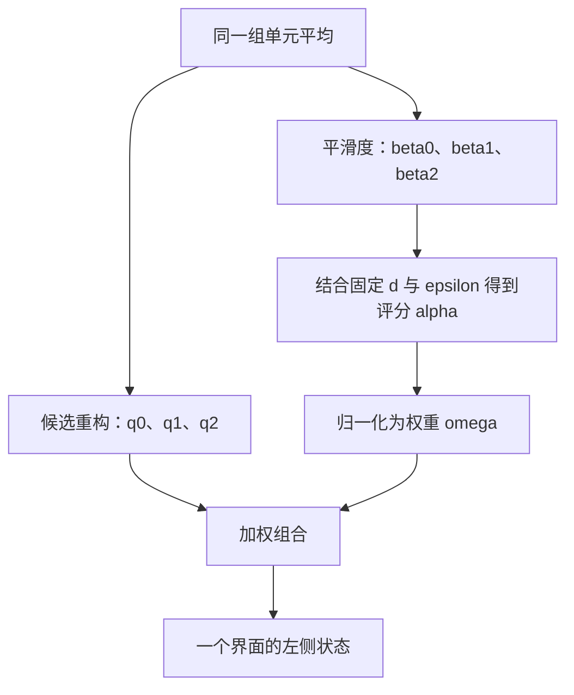

本讲目标：把一个 WENO 重构模块拆成候选重构、平滑度、非线性评分、归一化
和聚合，并能解释每个中间量的含义。公式对应本仓库 `burgers.weno_left`
的均匀网格有限体积 WENO5-JS 左状态重构。

要比较 ENO、WENO、TENO 与 MP5 的不同处理方式，可参阅
[常见重构类型](02a-reconstruction-families.md)。本讲的 JS 是 WENO 的一种
权重构造；它与 Z 的区别发生在重构内部，不是界面通量家族的区别。

上一讲自测：相邻平均值 1、3、4 给出左右变化量 2、1，minmod 斜率为 1，
中间格的两个端点是 2.5、3.5。

## 1. 继续改善重构：从多个局部估计中组合答案

上一讲用一条受限直线描述格内变化。还想提高光滑区域的空间精度时，可以
使用更多邻居、构造更高次的多项式。但在有间断的数据上，把所有邻居都同样
用于一个高阶拟合，可能产生额外振荡。

WENO 的思路是先构造几个局部候选，再根据数据变化调整它们的权重。
它的全称是 weighted essentially non-oscillatory。其加权重构思想可见
[Zhang 与 Shu 的 ENO/WENO 综述，第 2 节](https://academicweb.nd.edu/~yzhang10/WENO_ENO.pdf)。

本讲始终在完成一个任务：由单元平均估计**同一个界面 \(i+1/2\) 的左侧状态**。
三个候选都是这个位置的三个估计，不是三个不同界面，也不是三次时间推进。

## 2. stencil：究竟读取哪些邻居？

stencil 可以理解为“本次计算使用的一组网格位置”，常译作模板。
WENO5 左重构读取五个平均值：

\[
\bar u_{i-2},\ \bar u_{i-1},\ \bar u_i,\ \bar u_{i+1},\ \bar u_{i+2}.
\]

从它们中取三个互相重叠的三格子模板：

| 模板 | 使用的单元 | 输出 |
|---|---|---|
| \(S_0\) | \(i-2,i-1,i\) | 候选界面值 \(q_0\) |
| \(S_1\) | \(i-1,i,i+1\) | 候选界面值 \(q_1\) |
| \(S_2\) | \(i,i+1,i+2\) | 候选界面值 \(q_2\) |

每个模板确定一条二次多项式，使它在三个格子上的平均值分别匹配已知数据，
再到同一个界面取值。这里拟合的是**单元平均约束**，不能直接当作三个
中心点值做普通插值。

## 3. 候选重构：分别给出三个估计

为避免索引太长，暂记五个输入为 \((A,B,C,D,E)\)，对应偏移 -2 到 +2。
三个候选值是：

\[
q_0=\frac{2A-7B+11C}{6},\qquad
q_1=\frac{-B+5C+2D}{6},\qquad
q_2=\frac{2C+5D-E}{6}.
\]

这些系数来自刚才的二次多项式平均值约束，不是本讲中训练得到的参数。
代码把这三个界面取值命名为 `p0,p1,p2`；本教程用 \(q_r\) 强调它们是
候选值，而不是整条多项式。

光滑例子：输入 \((0,1,2,3,4)\)，三个候选都得到 \(2.5\)。这与线性增长
数据在第 \(i\) 格右边界的值一致。

但如果模板跨过间断，这些候选可能彼此不同，我们还需要判断怎样分配权重。

## 4. 平滑度：评估每个模板上的变化

每个候选对应一个非负平滑度指标 \(\beta_r\)。本仓库使用 Jiang–Shu 指标，
由该模板上若干差分的平方加权相加。

- 常数数据给出 \(\beta_r=0\)。
- 线性变化一般给出非零指标；所以“非零”不等于“不光滑”。
- 在相同局部尺度下，模板包含剧烈变化时，指标通常较大。

它是局部变化的数值指标，不是真实误差，也不能单独证明模板中存在激波。
输入幅度和网格尺度都会影响它的数值。

例如中间模板的公式是：

\[
\beta_1=\frac{13}{12}(B-2C+D)^2+\frac14(B-D)^2.
\]

第一项使用二阶差分，第二项使用跨两个格子的差分。更精确地说，JS 指标
对应候选多项式在目标单元中、经过网格尺度调整的一阶和二阶导数平方积分。
这里先记住其数值职责，系数推导可在后续专题中展开。

<details>
<summary>另外两个指标：用于逐行核对代码</summary>

\[
\beta_0=\frac{13}{12}(A-2B+C)^2+\frac14(A-4B+3C)^2,
\]

\[
\beta_2=\frac{13}{12}(C-2D+E)^2+\frac14(3C-4D+E)^2.
\]

</details>

候选值 \(q_r\) 和平滑度 \(\beta_r\) 都由模板数据计算。只有一个候选界面值
不足以恢复模板中的变化情况，因此不能把数据流画成 \(q_r\to\beta_r\)。

## 5. 权重：兼顾光滑区精度与间断附近的模板选择

先有一组固定的线性权重：

\[
(d_0,d_1,d_2)=(0.1,0.6,0.3).
\]

它们经过精度条件设计：在均匀网格上，把三个候选按这些系数组合，可以
恢复五单元模板的高阶界面近似。它们不是“哪个候选永远更好”的概率。

再根据当前数据的平滑度计算评分：

\[
\alpha_r=\frac{d_r}{(\epsilon+\beta_r)^2},\qquad \epsilon=10^{-6}.
\]

在其他条件相同时，\(\beta_r\) 越大，评分越小。\(\epsilon\) 使常值模板也
能计算，并影响评分对小变化的敏感程度。

最后归一化：

\[
\omega_r=\frac{\alpha_r}{\alpha_0+\alpha_1+\alpha_2}.
\]

这样 \(\omega_r\ge0\) 且 \(\sum_r\omega_r=1\)。若三个 \(\beta_r\) 相等，
共同分母消去，恰好得到 \(\omega_r=d_r\)，并不是各占三分之一。

经典实现中的公式和参数固定，但权重随输入数据改变，因此叫“非线性权重”。
它们是每次重构现场计算的数值权重，不需要先训练模型。

## 6. 聚合：三个候选合成一个界面状态

\[
\boxed{u^L_{i+1/2}=\omega_0q_0+\omega_1q_1+\omega_2q_2.}
\]

到这里仍然得到的是一个**状态**。还需要在右侧做镜像重构，得到
\(u^R_{i+1/2}\)，然后才能一起交给 Godunov 等数值通量组件。

非负且和为 1 的权重使结果位于候选值的范围内，但候选本身可能超出原始
单元平均的范围。因此不能只凭权重归一化就推出整个 WENO 方法保正、无超调或稳定。

## 7. 手算：模板跨过间断时怎样调整？

取五个单元平均为：

```text
    i−2       i−1        i        i+1       i+2
     1         1         1    │    0         0
                             ↑
                       目标界面 i+1/2
```

目标是估计这个界面的左状态。用上面的公式得到：

| 模板 | 三个输入 | 候选值 \(q_r\) | 平滑度 \(\beta_r\) |
|---|---|---:|---:|
| \(S_0\) | 1、1、1 | 1 | 0 |
| \(S_1\) | 1、1、0 | \(2/3\) | \(4/3\) |
| \(S_2\) | 1、0、0 | \(1/3\) | \(10/3\) |

\(S_0\) 完全位于左侧常值区；另外两个模板跨过跳变。
取代码的 \(\epsilon=10^{-6}\)，评分约为：

\[
(\alpha_0,\alpha_1,\alpha_2)
\approx(10^{11},0.3375,0.027).
\]

归一化后，\(\omega_0\) 极接近 1，另两个权重约为
\(3.375\times10^{-12}\) 和 \(2.70\times10^{-13}\)。最终左状态约为
\(0.9999999999987\)，接近左侧平台的 1。

有限的 \(\epsilon\) 下，另外两个权重不是精确的零。如果直接使用固定线性
权重，则得到 \(0.1\times1+0.6\times(2/3)+0.3\times(1/3)=0.6\)。
这个对比展示了非线性权重在此例中怎样抑制跨间断模板。

这是局部重构手算，不是整条 PDE 轨迹的精度或性能实验。

## 8. 组件的数据流



| 内部机制 | 输入 | 输出 | 数值职责 |
|---|---|---|---|
| 候选重构 | 各三格子模板 | \(q_0,q_1,q_2\) | 产生同一界面位置的多个估计 |
| 平滑度 | 各模板上的差分 | \(\beta_0,\beta_1,\beta_2\) | 描述候选模板的局部变化 |
| 评分 | \(\beta_r,d_r,\epsilon\) | \(\alpha_r\) | 综合精度设计与局部变化分配相对评分 |
| 归一化 | 全部 \(\alpha_r\) | \(\omega_r\) | 让权重非负且和为 1 |
| 聚合 | 全部 \(q_r,\omega_r\) | 一个界面状态 | 输出本次重构结果 |

L1 可以把这一整段当作 WENO 重构；L2 则观察候选、平滑度和权重等内部机制。
继续打开，候选是线性组合，平滑度是差分的平方和，权重包含加法、平方、
除法和归约。这些就能继续用更细的离散/代数构件表示。

例如保留候选不变，只更换评分公式，就改变了重构内部机制，同时保留
相同的输入和输出接口。替换后能否保留精度和稳定性，需要另外验证。

## 9. 对照代码，确认计算停在哪一步

[`burgers.py` 的 `weno_left`](../../solver_sculpt/burgers.py) 对应：

| 代码变量或表达式 | 本讲含义 |
|---|---|
| `a,b,c,d,e` | 五个单元平均 \(A,B,C,D,E\)；代码参数 `d` 不是线性权重 \(d_r\) |
| `p0,p1,p2` | 候选界面值 \(q_r\) |
| `beta0,beta1,beta2` | 平滑度指标 |
| `a0,a1,a2` | 未归一化评分 \(\alpha_r\) |
| `(a0*p0+a1*p1+a2*p2)/(a0+a1+a2)` | 归一化与加权组合合写 |

`expert_flux` 的 `weno5` 分支继续做：

```python
left_state = weno_left(um2, um1, u, right, up2)
right_state = weno_left(up3, up2, right, u, um1)
return godunov(left_state, right_state)
```

右侧调用把模板镜像。每侧五格，两侧合起来使用偏移 -2 到 +3 的六格。
`weno_left` 返回状态；`expert_flux` 再返回通量；外层仍需守恒残差与时间积分。
本例不是有限差分的通量分裂 WENO。

WENO5 的“五”指五阶空间设计精度，不能据此把三阶段 RK 说成五阶时间积分。
实际精度还依赖光滑性、临界点处的权重行为及其他离散环节，间断附近也不
保持同样的光滑区阶数。

仓库另有 [`weno_graph.py`](../../solver_sculpt/weno_graph.py)，把这套重构与
Godunov 通量手工写成基础算子图。理解本讲各中间量后，再读该文件的
stencil 收集、候选与指标、权重与聚合会更容易；其 14 层是特定图的计算深度，
不要与 L0–L4 的抽象层级混为一谈。

## 10. 自测

若五个单元平均全部等于 5：三个候选分别是多少？平滑度是多少？
权重是各占三分之一，还是 \((0.1,0.6,0.3)\)？最终重构状态是多少？

<details>
<summary>展开答案</summary>

三个候选都为 5，三个指标都为 0。评分具有同一个 \(\epsilon^2\) 分母，
归一化后得到固定权重 \((0.1,0.6,0.3)\)，最终重构状态仍为 5。
权重和为 1 保留了这个常值；并不需要三个权重相等。

</details>

下一讲[从重构返回 Burgers 通量组件](05-burgers-riemann-flux.md)：波速为什么依赖状态，激波和稀疏波
怎样影响 Godunov 界面通量。

## 方法来源

- [Zhang 与 Shu，ENO and WENO Schemes，2016，第 2 节](https://academicweb.nd.edu/~yzhang10/WENO_ENO.pdf)：有限体积平均值重构及 WENO 权重。
- [Jiang 与 Shu，Efficient Implementation of Weighted ENO Schemes，1996](https://www.sciencedirect.com/science/article/pii/S0021999196901308)：JS 平滑指标和权重的原始方法来源；论文还讨论有限差分形式，不能据此混淆本仓库的状态重构接口。
