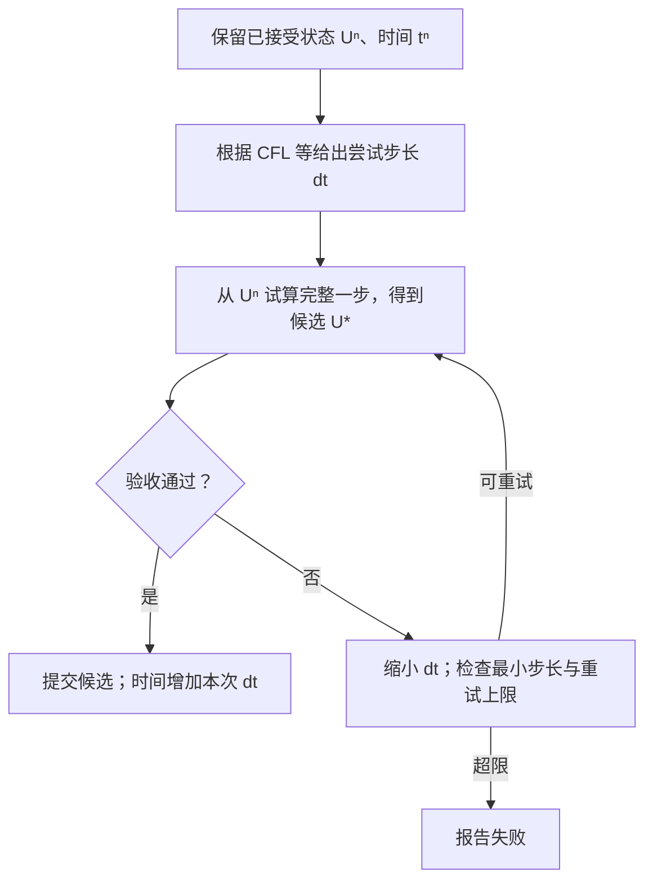

如果重试指“某个时间步不满足要求，缩小步长后重新计算”，它属于
**时间步控制器**（step controller）的接受／拒绝与重试职责。它在完整单步
计算之外组织调用；重构、通量与 RK 积分负责产生候选状态，控制器决定是否
接受这个候选。具体软件可能把这些职责写在同一个类或函数里。

控制器是一类组件，其中的选步、验收与更新策略可以采用不同算法。
上一讲看到的“失败后减半”只是其中一种具体策略。

## 1. 先区分四项职责

| 职责 | 输入 | 输出或动作 |
|---|---|---|
| 步长建议 | 当前状态、波速、网格、时间上限 | 尝试使用的 \(\Delta t\) |
| 单步计算 | 已接受状态 \(U^n\)、时间 \(t^n\)、尝试步长 | 候选 \(U^*\)，以及需要的阶段诊断 |
| 验收判据 | 候选状态与诊断信息 | 接受或拒绝 |
| 重试控制 | 验收结果、原状态、当前步长、重试次数 | 提交候选，或缩步重做，或报告失败 |

常见判据包括实际阶段 CFL 是否超限、状态是否有限、密度与压力是否有效，
以及有误差估计器时局部误差是否合格。这些是不同的检查；不能把一个只检查
CFL 的函数当成已经检查了保正性或误差。哪些判据适用，必须由具体算法定义。

单步时间积分器回答“给我一个步长，怎样算出候选下一状态”；控制器回答
“这个候选能否成为正式下一状态，以及失败后怎么办”。
例如 [PyClaw 的求解器接口](https://www.clawpack.org/v5.12.x/pyclaw/solvers_reference.html)
分别提供 `step`、`accept_reject_step` 和 `get_dt_new` 等职责。

## 2. 重试放在整步外面



若单步方法是 SSP-RK3，图中的“试算完整一步”包含它的三个阶段，阶段内部
又调用边界、重构、通量和残差。拒绝时丢弃本次尝试的阶段结果，下一次从
同一个 \(U^n,t^n\) 重新计算。实现可以在检测到失败时提前终止一次尝试。

以不原位改写输入状态的单步接口为例，控制流程可以示意为：

```python
# 伪代码：advance 不原位修改 U_old；检查函数与阈值由具体算法提供。
U_old, t_old = U, t
dt = min(suggest_dt(U_old), target_time - t_old)

for attempt in range(max_attempts):
    candidate, diagnostics = advance(U_old, t_old, dt)
    if acceptable(candidate, diagnostics):
        U, t = candidate, t_old + dt
        break
    dt *= 0.5
    if dt < dt_min:
        raise StepFailure("步长已小于允许下限")
else:
    raise StepFailure("超过最大尝试次数")
```

步长减半是一种策略，也可以按 CFL 超限比例或误差估计调整，取决于控制器。
这里的上限和失败分支使流程有明确出口；缩小步长并不能解决所有错误。

关键是只有接受后才推进物理时间、更新正式状态和已接受步的历史。若真实
实现会原位写状态，则需要备份和恢复；多步法还要保留对应历史，其他会影响
后续求解的可变数据也应与拒步同步恢复。

## 3. 已经用 CFL 选步，为什么仍然可能拒绝？

步前使用的是初始状态上的速度估计。非线性方程的 RK 阶段状态会改变，
重构界面值也可能改变，实际检测到的最大速度可能更大。

假设目标 CFL 为 0.4，格宽为 0.1，步前速度估计为 2：

\[
\Delta t=0.4\times0.1/2=0.02.
\]

若本次尝试发现阶段最大速度为 3，则：

\[
\nu_{\mathrm{stage}}=3\times0.02/0.1=0.6>0.4.
\]

控制器可以拒绝这一步，把步长改为 0.01，从原状态重算。如果新尝试的
阶段最大速度仍为 3，则 CFL 为 0.3；但速度必须重算，不能假定它保持不变。
若验收通过，时间只前进 0.01，失败尝试的 0.02 不计入物理时间。

## 4. 控制器有哪些常见算法？

先看不同策略使用什么信息。下面各行不是严格互斥的完整算法家族：其中
有步长建议方式、失败处理方式，也有误差反馈方式，实际控制器可以组合它们。

| 策略 | 依据什么决定步长 | 主要行为 |
|---|---|---|
| 固定步长 | 用户预先给定的 \(\Delta t\) | 通常只在输出或结束时刻截短；本身没有自适应重试 |
| CFL 驱动 | 当前传播速度、网格、目标 CFL | 波速增大时缩小步长，减小时可增大步长 |
| 固定倍率回退 | 本次是否被拒绝 | 每次失败令 \(\Delta t\leftarrow\rho\Delta t\)，如 \(\rho=0.5\) |
| CFL 比例修正 | 实测 CFL 与目标 CFL 的比值 | 根据超限程度调整，而不是每次都减半 |
| 单步误差反馈 | 当前尝试的归一化局部时间误差估计 | 误差过大时缩步重试，较小时可以增大后续步长 |
| PI / PID 误差控制 | 当前与此前的误差信息 | 利用误差历史调节步长，使变化更平稳；具体效果依赖参数与问题 |

CFL 控制的实例可见 [PETSc 的 CFL 控制器](https://petsc.org/release/manualpages/TS/TSADAPTCFL/)；
基于当前误差的 I-controller 与带历史的 PI/PID-controller 可见
[SciML 的控制器文档](https://docs.sciml.ai/DiffEqDocs/dev/api/ordinarydiffeq/api/controllers/)。

### 4.1 同一次超限，可以有不同的缩步算法

仍取刚才的尝试步长 0.02、实测 CFL 0.6、目标 CFL 0.4。

- 固定减半：下一次尝试使用 \(0.02\times0.5=0.01\)。
- 按 CFL 比例修正：在暂不加额外安全系数时，使用 \(0.02\times0.4/0.6\approx0.01333\)。

第二种规则可写成：

\[
\Delta t_{\mathrm{new}}
=s\,\Delta t_{\mathrm{trial}}
\frac{C_{\mathrm{target}}}{\nu_{\mathrm{observed}}},
\qquad \nu_{\mathrm{observed}}>0.
\]

\(s\) 是可选的额外安全系数；目标 CFL 本身也可能已经留有余量。
实际还需要增长／缩小倍率限制、零值或非有限诊断的处理。新步长下的阶段
状态可能改变，因此修正后仍需重新试算与验收。
类似的 CFL 比例更新可见
[PyClaw 5.13.1 `get_dt_new` 源码](https://github.com/clawpack/pyclaw/blob/v5.13.1/src/pyclaw/solver.py#L486)。

### 4.2 误差控制需要额外的误差估计

CFL 主要约束与传播和稳定性相关的步长；满足 CFL，不代表时间误差已经达到
用户要求。误差控制还需要估计这一步的局部时间离散误差。

嵌入式 RK 是一种常见来源：共享一批阶段导数，用两组权重得到两个不同阶数
的结果，从差值构造误差估计。例如 [SciPy 的 RK45](https://docs.scipy.org/doc/scipy/reference/generated/scipy.integrate.RK45.html)
使用 5(4) 阶配对。误差估计器和决定步长的控制器仍是两项可区分的职责。

一种归一化示意为：

\[
e=\left\|
\frac{U_{\mathrm{high}}-U_{\mathrm{low}}}
{\mathrm{atol}+\mathrm{rtol}\max(|U^n|,|U_{\mathrm{high}}|)}
\right\|.
\]

分量缩放与范数需要明确约定，分母应为正；通常以 \(e\le1\) 表示这项误差
检查通过。若估计误差在局部近似按 \(\Delta t^q\) 缩放，基本更新规则为：

\[
\Delta t_{\mathrm{new}}
=\Delta t\,
\operatorname{clip}\left(s e^{-1/q},f_{\min},f_{\max}\right),\qquad e>0.
\]

这里 \(q\) 是误差估计的步长幂次，不是 RK 阶段数。例如常见 5(4) 配对的
差值主项为 \(O(\Delta t^5)\)，对应 \(q=5\)。\(e=0\) 和非有限误差需要单独
处理；拒步分支也应确保给出更小的下一次尝试步长。

PI/PID 则把此前误差也纳入更新。完整算法还需说明历史在接受、拒绝和重启时
如何更新，不能只把一个历史变量随意插入上式就认定得到了合适的控制器。

这类误差估计针对时间离散，不直接估计空间重构误差；在显式双曲 PDE 中，
误差建议步长通常还要服从适用的 CFL 约束。例如可以组合为：

\[
\Delta t_{\mathrm{trial}}
=\min(\Delta t_{\mathrm{error}},\Delta t_{\mathrm{CFL}},
\Delta t_{\max},t_{\mathrm{target}}-t).
\]

验收还可同时要求状态有限、满足所需物理约束。它们是不同判据的组合，不是
某一个误差阈值自动涵盖了所有要求。

## 5. 对应仓库：哪些策略已经实现？

**整合后的更新：** 相关分支已合入 main 的
[`20b2e3c23`](https://github.com/NOrangeeroli/meta-pde-solver/commit/20b2e3c2372ee3b76b9450ba95cafdaefb6694ad)。
下文保留整合前、限定入口的核查记录，不再代表最新合并状态。此前遗漏的
`burgers-budget-search` 中，`burgers_control.ControllerSpec` 已有原生 CFL
比例重试与 previous-CFL 策略；它们也已合入。`control.py` 等扩展现在已被
跟踪，固定倍率通过 `retry_factor` 配置，默认仍为 0.5。Euler 的 step-doubling
误差与反馈已提取到 `solver_sculpt/time_control.py`，由原 `frozen_controller`
调用；尚未自动接入所有 hierarchy 单步方法，也未新增 PI/PID。
最新工程入口见
[控制器实现地图](https://github.com/NOrangeeroli/meta-pde-solver/blob/20b2e3c2372ee3b76b9450ba95cafdaefb6694ad/docs/hierarchy/TIME-CONTROLLERS.md)。

**不是所有策略都已实现，也不是所有已有实现都已接入五层组件体系。**
下面是 2026-09-24 对当前早期代码、主集成工作树、`hyperbolic-components-v1`
与 `burgers-controller-frontier` 分支的源码核查；分支中的功能不能自动视为
已合入主线。这里的“已有”表示有具体执行代码，不表示已证明适用于所有问题。

| 策略 | 项目内实现情况 | 五层 hierarchy 组件情况 |
|---|---|---|
| 固定步长 | 已有；例如 frontier 的 `fixed032` 采用名义步长 \(\Delta t=\Delta x/32\)，输出时刻会截短，失败仍可回退 | 给定步长的单步／rollout 已有；固定选步与失败策略可分别理解 |
| CFL 驱动选步 | 已有；根据当前状态估计波速，再计算步长 | 已有 `CFLTimeStep`、`CFLRollout` |
| 失败后固定倍率缩步 | 已有；原生 HyperBench 的 Burgers 求解器失败后减半 | 本地 `control.py` 扩展已有，倍率 0.5 写在展开规则中 |
| 按实测 CFL 比例修正 | 通过外部 PyClaw 后端提供；项目适配器设置目标和上限 | 本次核查未发现已拆成原生 hierarchy 控制组件的版本 |
| 局部时间误差反馈 | frontier 分支已有 **step doubling**：比较一整步与两个半步 | 本次核查的 hierarchy 控制器尚未接入这套估计与步长更新 |
| PI / PID 误差控制 | 在上述求解器与控制器源码中未发现实现 | 尚未发现对应的误差历史与控制更新组件 |

可定位的版本依据：

- 组件化 CFL：[CFLTimeStep](https://github.com/NOrangeeroli/meta-pde-solver/blob/90bf0dcc76899f6a6f8abc29dc474103681fcddb/solver_sculpt/hierarchy/programs/cfl.py)、[CFLRollout](https://github.com/NOrangeeroli/meta-pde-solver/blob/90bf0dcc76899f6a6f8abc29dc474103681fcddb/solver_sculpt/hierarchy/programs/cfl_rollout.py)。
- 主集成工作树：[Burgers 的 CFL 与减半循环](https://github.com/NOrangeeroli/meta-pde-solver/blob/40a1d6ec776d2f4e79dfec1bc77490e6ada1316a/hyperbench/solvers/burgers_combinations.py#L137)、[PyClaw 适配器](https://github.com/NOrangeeroli/meta-pde-solver/blob/40a1d6ec776d2f4e79dfec1bc77490e6ada1316a/hyperbench/solvers/claw.py#L178)。CFL 比例更新本身由上面链接的 PyClaw 上游源码执行。
- `codex/burgers-controller-frontier`：[固定、CFL、误差控制预设及实现](https://github.com/NOrangeeroli/meta-pde-solver/blob/c8d61a33a41a2dc6b50cf9ea719ef77550faa4f3/hyperbench/solvers/frozen_controller.py)。

### 5.1 当前组件化重试路径

早期 [`burgers.py` 的 `step`](../../solver_sculpt/burgers.py) 执行给定步长的
SSP-RK3，没有内置缩步重试。第七讲引用固定提交中的 `programs/CFLRollout`
会逐步选择步长，但同样不能仅凭“CFL 自适应”就认定存在接受／拒绝循环。

2026-09-24 核查时，另一个本地工作树 `hyperbolic-hierarchy-3555` 中有下面
这套扩展。三个文件当时均未被 Git 跟踪，不属于此前教程引用的固定提交
`90bf0dcc76899f6a6f8abc29dc474103681fcddb`；这里记录当前本地实现，不为它们
构造不存在的固定提交链接。

| 本地文件，均位于 `solver_sculpt/hierarchy/` | 本次核查到的职责 |
|---|---|
| `hyperbench_burgers.py` | 提供 `step`、`initial_speed`、`stage_speed`、`cfl_accepted` 等数值输出；该配置的验收输出只检查阶段 CFL 是否不超过 0.4 |
| `hyperbench_trajectory.py` | `build_burgers_trajectory` 把初始步长估计、完整单步和验收输出交给调度器 |
| `control.py` | `adaptive_schedule` 接收这些计算图；`advance_retry` / `while_rejected` 组织减半重试、有限值检查和状态提交 |

该控制器只有提供 `acceptance` 时才走重试路径。代码先把试算结果存为
`candidate`；验收为假或候选包含非有限值时重试，每次把 `dt` 乘 0.5。
它保留原 `u`、`t`，直到循环通过后才把 `candidate` 写入 `u` 并推进 `t`。
另外还有最小步长、累计拒绝次数和步数等限制。

这里没有自动给所有方程增加密度、压力或误差判据，也没有通用的异常捕获
重试机制；具体计算抛出的异常不能一概描述为“控制器会自动缩步解决”。

进一步看该本地 Burgers 配置，它组合了四个选择：

1. 用初始重构界面速度和目标系数 **0.35** 建议本步尝试步长。
2. 截短到当前请求的输出时刻。
3. 试算后检查阶段 CFL **不超过 0.4**，并检查候选是否有限。
4. 被拒绝时将步长乘 **0.5**，从原状态重试。

因此 0.35、0.4、0.5 分别属于步长建议、验收阈值和回退倍率，含义不同。
它没有在这个路径中使用嵌入式误差或 PI/PID 历史。

通用 `adaptive_schedule` 已把 `limit`（步长建议）和 `acceptance`（验收）
作为数值计算图输入；但当前的 `dt *= 0.5` 写在控制展开规则中。
这说明“组件可以有多种算法”和“当前 API 已开放全部算法选择”是两回事。
要加入 PI/PID，还需显式增加误差估计、历史状态与更新规则，不能只改一个
方法名称。

### 5.2 另一个分支的误差控制具体做了什么？

`frozen_controller.py` 固定采用 MP5 重构、Godunov 通量与 Euler 时间积分。
传入 `tol` 后，从同一个已接受状态出发，既计算一个完整 Euler 步得到
`candidate`，也计算两个半步得到 `refined`，用两者差值的均方根估计时间误差。
误差除以固定尺度 `max(max(abs(U_initial)), 0.01)`，再与 `tol` 比较。
这与第 4.2 节示意的逐分量 `atol` / `rtol` 缩放不是同一种归一化。

有限误差下，其建议倍率为：

\[
f=\operatorname{clip}\left(0.9\sqrt{\frac{\mathrm{tol}}
{\max(\mathrm{err},10^{-30})}},\ 0.2,\ 2.0\right).
\]

接受后用 \(\Delta t f\) 建议下一步，仍受名义 CFL 步长与输出时刻限制；
拒绝后用 \(\Delta t\min(f,0.9)\) 重试。非有限误差使用倍率 0.2。
没有启用 `tol` 时，拒步默认减半。`error1000` 与 `error0200` 是已有的两个
误差控制预设，容差分别为 0.001 与 0.0002。

这里需要记住两点：**最终接受的是一整步 `candidate`，两个半步仅用于估计**；
**它是 step doubling，不是嵌入式 RK 配对，也没有使用 PI/PID 的误差历史**。
它目前仍写在专用求解循环中。若要统一纳入组件体系，需要把“误差估计、
误差验收、步长更新”分别接入控制流程，而不仅是增加一个算法名称。

## 6. 在 L0–L4 中属于哪一层？

“在单步外面”描述的是执行嵌套关系，不能直接推出它只能属于某一个抽象层。
控制流程自身也可以从粗到细展开。上述本地 `control.py` 的组织方式是：

| 层级 | 控制流程的表示 |
|---|---|
| L0 | 整段轨迹及输出时刻的 `schedule` |
| L1 | 初始化与各输出区间 `initialize` / `interval` |
| L2 | 区间推进循环，以及 `advance_retry`、输出 `emit` 等操作 |
| L3 | 试算、判据赋值、`while_rejected`、缩步、状态与时间提交 |
| L4 | 可执行的赋值、循环、守卫及数值原语 |

这是控制流程的展开；循环体调用的 RK、重构和通量数值计算图，也可以展开
到自己的 L0–L4。不能把 L0–L4 理解成只允许重构到算术这一条固定链。

## 7. 训练脚本中的 backtrack 是另一种重试

当前目录的 [`train_conv.py`](../../solver_sculpt/train_conv.py) 和
[`train_extended.py`](../../solver_sculpt/train_extended.py) 还包含训练参数回溯：

\[
\theta_{\mathrm{trial}}
=\theta_{\mathrm{old}}+\eta(\theta_{\mathrm{proposed}}-\theta_{\mathrm{old}}),
\qquad \eta=1,\tfrac12,\tfrac14,\ldots
\]

这里缩小的是优化器提出的参数改变量，目的是找到可行的模型更新；没有把
PDE 时间步 \(\Delta t\) 减半。若回溯仍失败，相关路径会恢复旧参数和优化器
状态。它属于训练／优化控制，而非 PDE 时间推进控制。

读到“重试”时，先找三个量：**重做什么、缩小什么、恢复什么状态**。这比
只根据 `retry` 或 `backtrack` 的函数名分类更可靠。
