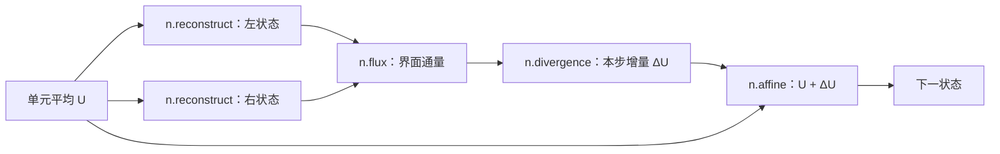

前面已经学过计算一步需要哪些职责。现在换一个问题：**同一个算法，在代码里
可以打开到多细？** L0–L4 回答这个问题。它们是程序的不同表示粒度，求解时
不需要依次运行五套算法。

本讲对照已合入 main 的固定提交
[`20b2e3c23`](https://github.com/NOrangeeroli/meta-pde-solver/commit/20b2e3c2372ee3b76b9450ba95cafdaefb6694ad)。
选择 `SolverSpec` 的基础有限体积入口；仓库还有其他完整轨迹与控制程序入口，
不把它们的节点名混在这条展开链中。

## 1. 先固定算法，再谈拆分

本讲配置：一维 Burgers 方程、均匀网格、周期边界，分片常数（PC）重构、
Godunov 通量、前向 Euler 时间推进。

\[
u_t+\left(\frac{u^2}{2}\right)_x=0,
\qquad
U_i^{n+1}=U_i^n-\frac{\Delta t}{\Delta x}
\left(\hat F_{i+1/2}-\hat F_{i-1/2}\right).
\]

这里 `U` 是单元平均数组。取三个单元，仅作手算示例：

\[
U=[1,2,4],\qquad \Delta x=1,\qquad \Delta t=0.1.
\]

每个界面按“第 i 格的右界面”编号。PC 重构给出：

| 右界面属于哪一格 | 左状态 | 右状态 | Godunov 通量 |
|---|---:|---:|---:|
| 第 0 格 | 1 | 2 | 0.5 |
| 第 1 格 | 2 | 4 | 2 |
| 第 2 格 | 4 | 1（周期接回） | 8 |

这些界面两侧均为正，Burgers 的 Godunov 通量在这里取左状态的物理通量。
因此右界面通量数组为 `F=[0.5,2,8]`；各格左界面通量则为 `[8,0.5,2]`。

\[
\Delta U=-0.1[0.5-8,\ 2-0.5,\ 8-2]
=[0.75,-0.15,-0.6],
\]

\[
U^{n+1}=[1.75,1.85,3.4].
\]

三个分量的和仍为 7。周期网格上的内部通量相互抵消，符合前面讲过的守恒。
下面每一层都表示这一步计算，最终应得到同一结果。

## 2. L0：保留完整单步的名字

```python
spec = SolverSpec(
    equation="burgers",
    reconstruction="pc",
    flux="godunov",
    integrator="euler",
    boundary="periodic",
)
graph = build(spec)
```

`build` 构造根节点 `s.step`：输入端口是 `u` 和 `dt_dx`，参数记录这套算法。
它首先是一份“要如何计算”的描述，并没有在构图时推进数组。

L0 回答：**给定状态与步长，这套完整单步算法是什么？**
在这条接口中，`dt_dx` 已由调用者给定；`s.step` 不负责自行选择 CFL 或重试。

## 3. L1：打开一步，看到数值模块

`lower(graph, 1)` 将 `s.step` 展开成模块组成的数据流：



| 模块 | 本例输入 → 输出 | 数值作用 |
|---|---|---|
| `n.reconstruct`，调用两次 | U → 左、右界面状态 | 从单元平均构造界面两侧数据 |
| `n.flux` | 左、右状态 → F | 为相邻单元提供公共通量 |
| `n.divergence` | F、dt_dx → ΔU | 右通量减左通量，再乘负的 dt/dx |
| `n.affine` | U、ΔU，权重 [1,1] → 下一状态 | 将本步增量加入旧状态 |

注意本入口的 `n.divergence` **已经包含 dt/dx**，输出是增量，而非尚未乘 dt
的变化率。不能再在外面多乘一次 dt。名字需要结合输入、输出和公式理解。

L1 回答：**完整一步由哪些有明确数值职责的模块组成？**

## 4. L2：打开模块，看到内部数值机制

本例的四类模块继续展开如下：

| L1 模块 | L2 节点 | 本例具体做什么 |
|---|---|---|
| `n.reconstruct` | `m.trace` | PC 被表示为零斜率的界面取值；右状态还需读取下一格 |
| `n.flux` | `m.riemann` | 使用 Burgers 的 Godunov 通量规则 |
| `n.divergence` | `m.divergence` | 通量向左取邻居，求差并乘负的 dt/dx |
| `n.affine` | `m.affine` | 按给定权重组合输入数组 |

PC 重构中：

\[
u^L_{i+1/2}=U_i+\tfrac12\times0=U_i,\qquad
u^R_{i+1/2}=U_{i+1}-\tfrac12\times0=U_{i+1}.
\]

Burgers 的 Godunov 通量在这个实现中使用等价的紧凑公式：

\[
\hat F(u^L,u^R)
=\frac12\max\left(\max(u^L,0)^2,\ \min(u^R,0)^2\right).
\]

它涵盖第五讲的激波与稀疏波分类。公式只针对这里的 Burgers 标量方程，
不能直接当成 Euler 方程组的 Godunov 通量。

本例很简单，所以有些模块只展开成一个同名机制。若换成 WENO5，
`n.reconstruct` 则会展开为多个 `m.candidate`、`m.smoothness`、`m.weight`
和 `m.blend`。**每一层不要求具有相同数量的节点。**

L2 回答：**模块内部采用什么具体数值机制？**

## 5. L3：把数值机制写成离散与代数构件

这一步已经能看到平方、最大值、邻居读取、线性组合等操作：

| L3 构件 | 本例用途 |
|---|---|
| `a.shift` | 读取下一格的右状态，或上一格的界面通量 |
| `a.square` | 计算 Burgers 通量所需的平方 |
| `a.max`、`a.min` | 组成 Godunov 通量公式 |
| `a.add`、`a.sub`、`a.mul` | 界面取值、通量差、步长缩放 |
| `a.linear` | 表示 `U + ΔU` 的线性组合 |

本仓库的 `shift(x, offset=1)` 表示输出位置 i 读取输入的 `x[i+1]`。
周期实现使用 `torch.roll(x, -1)`；不要把这里的 offset 与 `torch.roll`
参数的符号直接等同。通量差中的 offset 是 **-1**，读取 `F[i-1]`。

L3 回答：**机制具体由哪些离散与代数操作构成？**

## 6. L4：执行张量原语

例如：

```text
a.square(x)          → p.mul(x, x)
a.linear(x, y; 1, 1) → p.add(p.mul(1, x), p.mul(1, y))
a.shift(x, -1)      → p.shift(x, -1)
```

L3 的平方可以拆成 L4 的乘法；某些加减乘或邻居读取只需转换到对应原语。
L4 是当前解释器选择的执行边界，不是 CPU 指令层：例如 `p.shift` 最终仍
调用张量库操作。

L4 回答：**解释器最终执行哪些张量操作？**

## 7. 用实际代码验证五种表示

在含 `solver_sculpt/hierarchy` 的 main 检出根目录、安装了项目 Torch 依赖
的环境中运行下面代码。早期教学工作树若尚未包含 hierarchy，需切换到该
main 检出目录运行。

```python
import torch
from solver_sculpt.hierarchy import SolverSpec, build, lower, evaluate, walk

spec = SolverSpec(
    equation="burgers", reconstruction="pc", flux="godunov",
    integrator="euler", boundary="periodic",
)
graph = build(spec)
u = torch.tensor([1., 2., 4.], dtype=torch.float64)
expected = torch.tensor([1.75, 1.85, 3.4], dtype=torch.float64)

for k in range(5):
    representation = lower(graph, k)
    ops = sorted({n.op for n in walk(representation)
                  if n.op not in ("input", "constant")})
    result = evaluate(representation, {"u": u, "dt_dx": 0.1})
    torch.testing.assert_close(result, expected, rtol=0, atol=1e-14)
    print(k, ops, result.tolist())
```

本配置实际出现的节点类型为：

| 层级 | 节点类型（不含输入与常量） |
|---|---|
| L0 | `s.step` |
| L1 | `n.affine`、`n.divergence`、`n.flux`、`n.reconstruct` |
| L2 | `m.affine`、`m.divergence`、`m.riemann`、`m.trace` |
| L3 | `a.add`、`a.linear`、`a.max`、`a.min`、`a.mul`、`a.shift`、`a.square`、`a.sub` |
| L4 | `p.add`、`p.max`、`p.min`、`p.mul`、`p.shift`、`p.sub` |

这里列的是**节点类型**，同一种类型可能在图中出现多次。图中的连接表达
数据依赖，也可以共享中间结果；它不是一份只含不同函数名的清单。

`lower` 负责展开表示；`evaluate` 会先将收到的表示继续展开到 L4，再执行。
因此这段代码不是五个彼此独立的求解器对照。除了层级结果一致，我们还用
第 1 节独立手算的结果检查它，避免只验证“展开前后自己等于自己”。

源码定位：[完整单步与配置](https://github.com/NOrangeeroli/meta-pde-solver/blob/20b2e3c2372ee3b76b9450ba95cafdaefb6694ad/solver_sculpt/hierarchy/solvers.py)、
[L1 模块](https://github.com/NOrangeeroli/meta-pde-solver/blob/20b2e3c2372ee3b76b9450ba95cafdaefb6694ad/solver_sculpt/hierarchy/modules.py)、
[L2 机制](https://github.com/NOrangeeroli/meta-pde-solver/blob/20b2e3c2372ee3b76b9450ba95cafdaefb6694ad/solver_sculpt/hierarchy/mechanisms.py)、
[L3 构件](https://github.com/NOrangeeroli/meta-pde-solver/blob/20b2e3c2372ee3b76b9450ba95cafdaefb6694ad/solver_sculpt/hierarchy/algebra.py)、
[展开与 L4 执行](https://github.com/NOrangeeroli/meta-pde-solver/blob/20b2e3c2372ee3b76b9450ba95cafdaefb6694ad/solver_sculpt/hierarchy/ir.py)。

## 8. 控制器放在哪里？

本讲描述的是**给定 dt 的完整单步**。外层控制器可以先选择 dt，再调用这一步，
验收后提交，失败则换一个 dt 重试。改成 SSP-RK3 后，一次尝试还包含三个
阶段，各阶段需要重新计算空间模块。

控制流程本身也有自己的 L0–L4，例如 `control.adaptive_schedule` 将整段轨迹
展开为区间、循环、赋值与重试操作。所以“单步外层”是执行关系，“L0”是
表示粒度：两者不要混为同一个维度。

## 9. 自测

1. 将 Euler 换成 SSP-RK3，是否只是把 L4 的加法换一个名字？
2. 本例的 `n.divergence` 输出后，为什么不能再乘一次 dt？
3. 将 PC 换成 WENO5，在哪一层最容易观察候选模板和平滑度权重？
4. 五层结果相同，是否足以证明任何新通量都是正确的？

参考答案：1）不是；要改变阶段组合与依赖，并在阶段状态上重算空间模块。
2）该入口已经把 dt/dx 乘进通量差。3）L2；L1 保留“重构模块”的整体职责。
4）不够；层级一致性检查展开是否保留计算，还要用独立公式、守恒或其他
适用性质验证算法本身。

下一讲讨论：固定这些接口后，哪些组件可以替换，以及替换时必须满足哪些条件。
